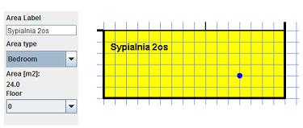

<html>
 <head>
<meta charset="UTF-8">
</head>
<body>
 
  <h1>About HSSDR</h1> 
 
 
 
 
 HSSDR(Hypergraph System Supporting Design and Reasoning) is designed to support conceptual   phase of architectural design. 
 

 

 HSSDR is a research prototype of a CAD tool. Its internal  representation is graph-based and reasoning mechanisms are driven by first-order logic. 

 

 HSSDR was created as part of ph. d. thesis by Szymon Gajek and members of a team at Department of Design and Computer Graphics
 at Faculty of Physics, Astronomy and Applied Computer Science of Jagiellonian University
 ( <a href="http://zpgk.fais.uj.edu.pl">http://zpgk.fais.uj.edu.pl</a>).  
 

 <h1 id="sec_window"> Repository content </h1> 
 
 
Feel free to use this code to continue this research or for another purposes. Source code is released under   the Apache License, Version 2.0.

 
 
Repository contains following elements: 

  <ol>
<li>HSSDR-release-1-0 most recent, release barnch of code.</li>
<li>HSSDR-trunk legacy branch of code stored for history reference</li>
<li>tags legacy targs marking major changes</li>
<li>other files - used only for this readme doc</li>
</ol>

Branches contain Eclipse project and all required jars(not a maven project. To configure development environment in eclipse use simple import, only Java JRE is needed. To run application indicate Start.main() as main method. No further configuration is required.
 

 
 <h1 id="sec_window"> Application features review </h1> 
  <h2 id="sec_window"> Main window </h2> 
 Main window with default Floor Layout tab is displayed after program starts.

  
  
  
  <h2 id="sec_layout">Floor layout</h2>
 

Creation of floor layout starts with the contour. Next,  contour may be divided on smaller areas, additional elements can be added  
and users actions may be withdrawn.
In order to choose editor size,  grid density and other parameters setting appropriate option in Settings is needed before starting to design.

   
    
   
<h2>Diagrams' building elements</h2>

 All diagrams' building elements are presented on the screen below:

 <ol>
<li>Contour line (thicker).</li>
<li>Division line (thinner).</li>
<li>Dotted division line.</li>
<li>Doors symbol.</li>
<li>External doors symbol.</li>
<li>Sensor.</li>
</ol>
 
 
  <h2>Setting number of floors</h2>
 

 While designing multi-storey buildings, number of floors has to be set prior to start of designing.
 Current floor for edition can be set with use of combo box  in the left panel. 

<h2 id="sec_hyper">Hypergraph view</h2>
 
  

  Hypergraphs are internal data structure used to represent design in HSSDR.
  Hypergraph view tab is mainly used by HSSDR creators for program analysis. Using this tab in not needed for architectural design. 
  Combo box on left panel changes  view between single floor and whole building. Displayed elements can be moved around the board for convenience. 
  Zooming is possible with use of  "+" and  "-" in upper part of left panel.
  

  
 
 <h2 id="sec_validation">Project validation</h2>
 
 
   <h2>Language of HSSDR tests</h2>
  
   

   With use of language of HSSDR large family of design constraints can be expressed. Those constraints are grouped in test sets. 
   They can concern: 
 

 <ul>
<li>domain knowledge, like ecological standards, legal, security or economical constraints </li>
<li>common design practices</li>
<li>specific project requirements.</li>
   </ul>
  
   
 
   Formulas of language of HSSDR tests express conditions concerning design elements  like doors or areas 
   and relations between design elements: direct ones as well as computed by the system. 
   The internal design representation is updated after every user action. 
   Tests are executed in background and their output is presented on validation console  and by pointing non-conform areas.
    
   

     
 Language of HSSDR tests is based on first-order logic. Additionally it contains also some useful  elements needed to reason about architectural design. 
	  Adding comments is possible as well as specification of failure and success  messaged for tests.
	  Language is built  of keywords, variables and predefined relations and functions, but is allows user  to define their own relations.  
 

 A design contains Rooms and Areas. 
	  All spaces are Areas, while Rooms are spaces that have not been yet divided. Rooms are children of Areas in division hierarchy. 
	  Division hierarchy can be displayed by clicking Undo button in Layout Editor. 
 

 
 
 
   <h2>Enabling tests sets</h2>
  
   

   Project Validation tab is used for switching on or off tests sets and for modification of tests sets' contents.   
   
 Test sets are text files, identified by file name. List of available test sets is displayed in left part of the validation tab.
  New tests sets can be added by creating new file in test_files folder.
  A tests set is taken into consideration during design analysis if appropriate checkbox in enabled.  
  When a test set is chosen on the list, its content is displayed in right side of the tab, and can be modified
  and saved with use of Save File button. 

  
 

  
 
 
 
</body>
</html>
